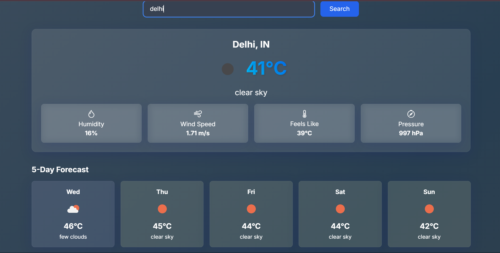

# Weather Dashboard

A modern, responsive weather dashboard web app that allows users to search for any city and view the current weather and a 5-day forecast. Built for a 1-hour coding test, with a focus on clean code, usability, and visual polish.

## Features
- Search for any city and get real-time weather data
- Displays current weather (temperature, humidity, wind, pressure, etc.)
- 5-day forecast with weather icons and subtle color tints
- Animated gradient background for a modern look
- Smooth card hover and fade-in animations
- Responsive design for desktop and mobile
- Error and loading states for better UX

## Tech Stack
- HTML, CSS (Tailwind, custom styles)
- JavaScript (vanilla)
- [OpenWeatherMap API](https://openweathermap.org/api)

## Setup & Usage
1. Clone or download this repository.
2. Open a terminal in the project directory.
3. Start a simple HTTP server (Python example):
   ```sh
   python -m http.server 8000
   ```
4. Open your browser and go to [http://localhost:8000](http://localhost:8000)
5. Enter a city name and view the weather!

## Notes
- This project was completed as a 1-hour coding test assignment. The focus was on delivering a clean, functional, and visually appealing solution within a short timeframe.
- The app uses the free OpenWeatherMap API. You can replace the API key in `index.html` with your own if needed.

## Screenshots


---
Feel free to use or extend this project!

## API

The Weather Dashboard uses the [OpenWeatherMap API](https://openweathermap.org/api) to fetch the weather data. You will need to replace the `API_KEY` variable in the `index.html` file with your own API key from OpenWeatherMap.

## Contributing

If you would like to contribute to the Weather Dashboard project, please follow these steps:

1. Fork the repository.
2. Create a new branch for your feature or bug fix.
3. Make your changes and commit them.
4. Push your changes to your forked repository.
5. Submit a pull request to the original repository.


## Testing

To test the Weather Dashboard, simply open the `index.html` file in a web browser and interact with the application. Ensure that the search functionality, current weather display, and 5-day forecast work as expected.
